Just IT Data Technician Bootcamp — Summary

This portfolio summarises my learning journey through the Just IT Data Technician Bootcamp, where I developed practical skills in Excel, Tableau & Power BI, SQL, Azure, and Python. Each week focused on a different part of the data workflow — from collecting and cleaning data to analysing, visualising, and presenting it using modern tools.

---

### Week 1 — Excel

I completed the Just IT Data Technician Bootcamp, where I learned how to work with data step by step. During the course, I practised collecting, cleaning, and analysing datasets in Excel.

Learned about common laws and regulations that must be followed when working with customers’ data (Data Protection Act, GDPR, Freedom of Information Act, Computer Misuse Act).

- What each law is about  
- Why it is important  
- A real-world example of how to follow it  
- How it impacts working with data  
- What could happen if it is breached

Worked with the retail-sales_dataset.xlsx file — sorted data, used the SUM and AVERAGE functions, applied filters to show top results, used the MAX and SWITCH functions, and applied conditional formatting. Created a pivot table and learned how to use it to analyse and visualise data effectively.

Created different types of charts — a line chart, a pie chart, and a column chart — and learned how to use them. I discovered that data visualisation supports analysis and interpretation by clearly showing patterns, relationships, and trends.

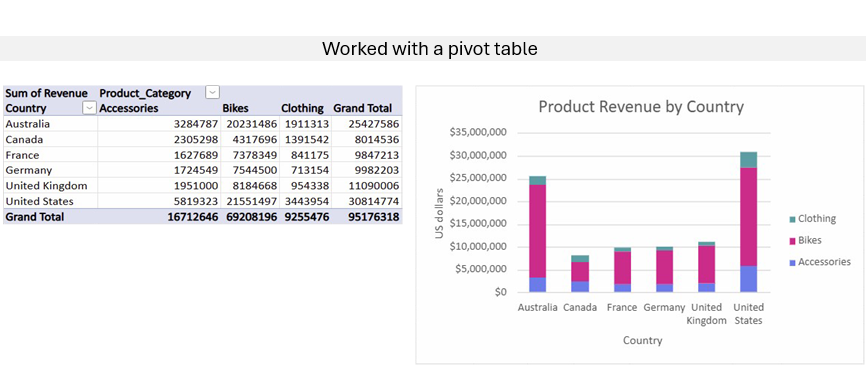

For the final project, I prepared and presented a data analysis report for an imaginary company that was losing customers. I analysed customer data, identified key reasons for churn, suggested improvements, and presented the findings using visual charts and summaries.

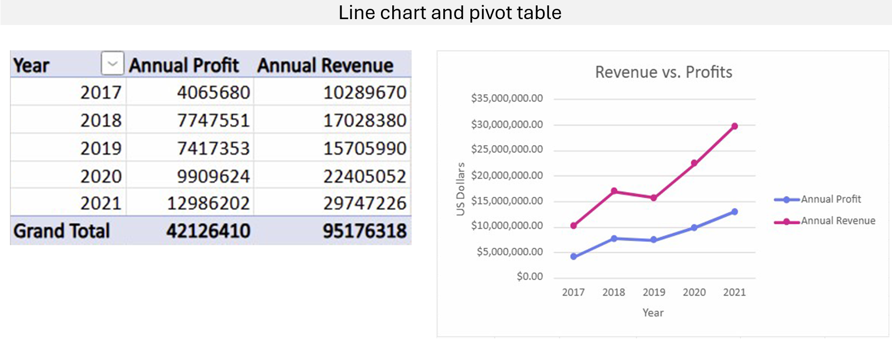

**Skill List**

- Excel: Pivot tables, formulas (SUM, AVERAGE, IF, SWITCH), charts, and conditional formatting  
- Data analysis: Cleaning, interpreting, and summarising datasets  
- Analytical thinking and strong attention to detail  
- Data protection awareness: GDPR and information security principles  
- Problem-solving and effective teamwork  
- Adaptability and time management skills  

---

### Week 2 — Tableau and Power BI

During the second week of the Just IT Data Technician Bootcamp, I learned how to work with Tableau and Power BI for data visualisation and reporting.

Using a dataset, I created my own dashboard that included a bar chart showing percentage changes and a UK map highlighting the main cities affected.

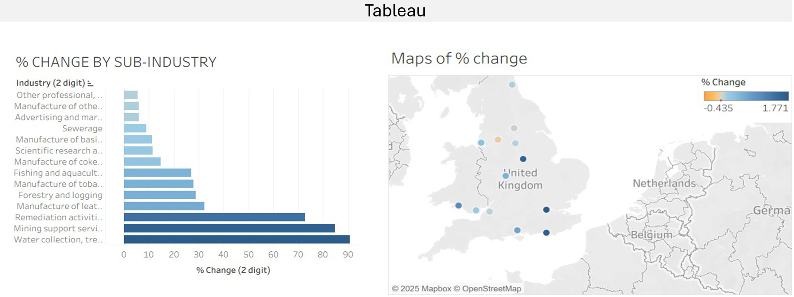

Using the Spotify dataset, I analysed the data to identify trends and key insights that could be useful for future organisational projects.

I completed several Power BI labs focused on loading, transforming, and visualising data, as well as working with DAX functions and dashboards.

Report created in Power BI Desktop and published online via Power BI Service.

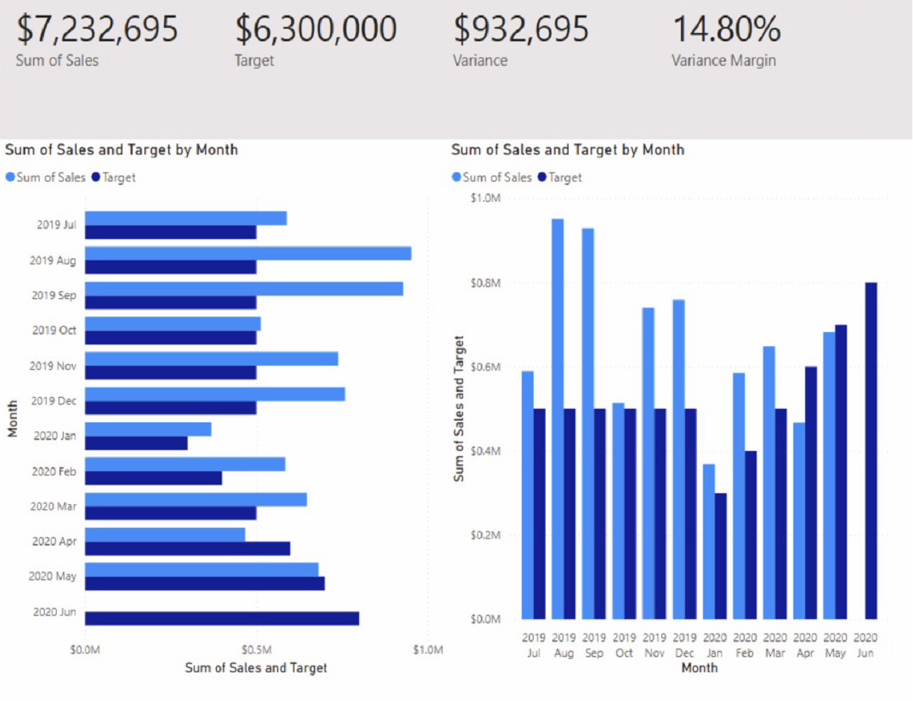

These exercises helped me understand how to connect datasets, design interactive reports, and apply key analytical tools in Power BI. By the end of the week, I felt more confident about turning data into clear visual insights and presenting results in a professional way.

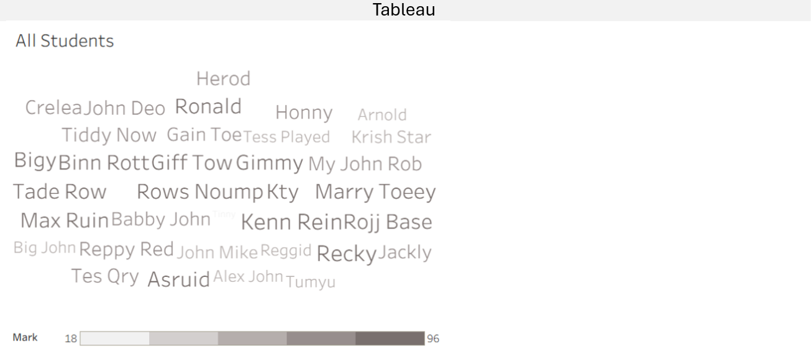

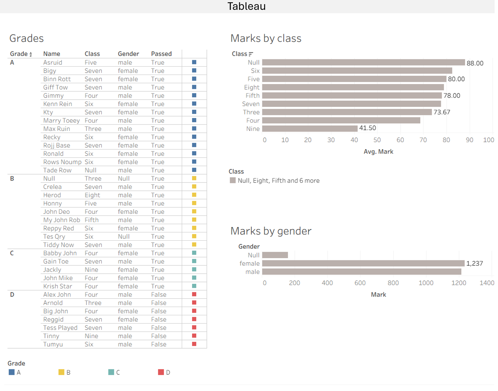

**Skill List – Tableau & Power BI:**

- Data visualisation and reporting using Tableau and Power BI  
- Creating interactive dashboards and visual reports  
- Cleaning, transforming, and modelling data for analysis  
- Using DAX for calculations, filters, and time intelligence  
- Exploring datasets to identify key patterns and trends  

---

### Week 3 — SQL

During the third week of the Just IT Data Technician Bootcamp, I learned the fundamentals of SQL and how to work with relational databases.

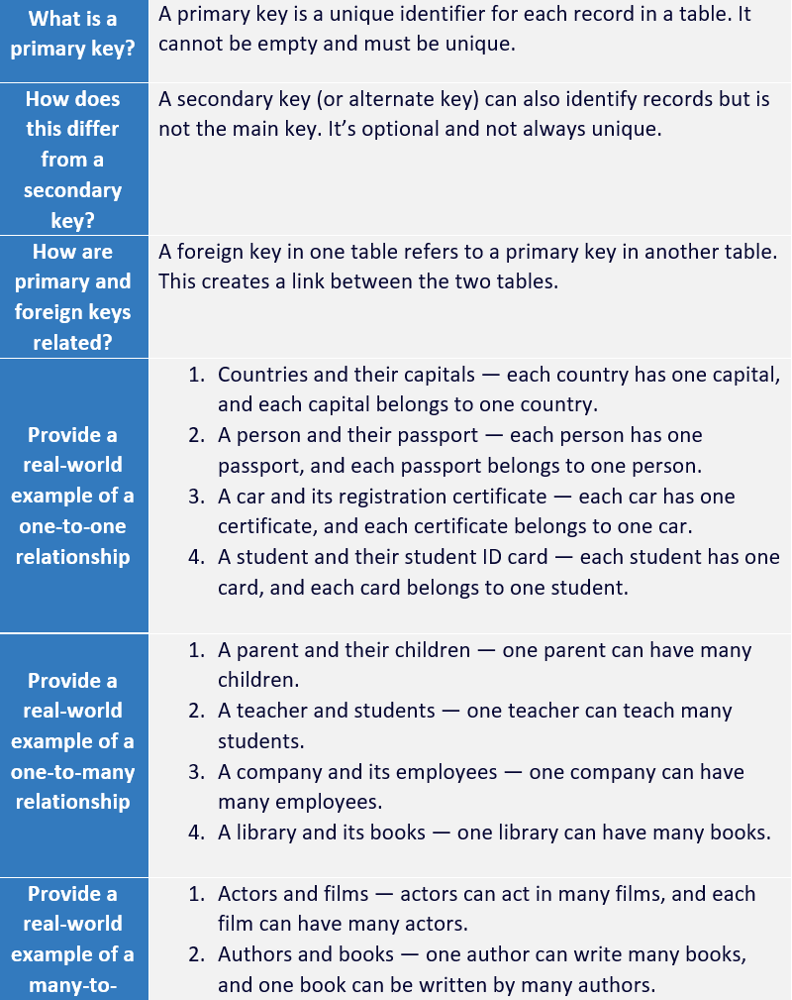

Learned what primary and foreign keys are, and how they are related. Provided real-world examples of one-to-one, one-to-many, and many-to-many relationships.

Understood the difference between relational and non-relational databases.

Researched different types of SQL JOINs: self join, right join, full join, inner join, cross join, and left join.

**Database Design Project**

In a group task, we were asked to design a database system for a small retail business that sells groceries and household products. The goal was to plan how the database would manage inventory, sales, and customer information, including a loyalty programme.

We discussed and described:

- Business requirements – identifying key data to store (products, customers, sales, loyalty points)  
- Database schema design – creating main tables (Products, Customers, Sales, SaleItems) and defining relationships using primary and foreign keys  
- SQL implementation – examples of CREATE TABLE, INSERT, and JOIN statements  
- Maintenance plan – checking data quality, saving backups, managing user access, and keeping information secure  

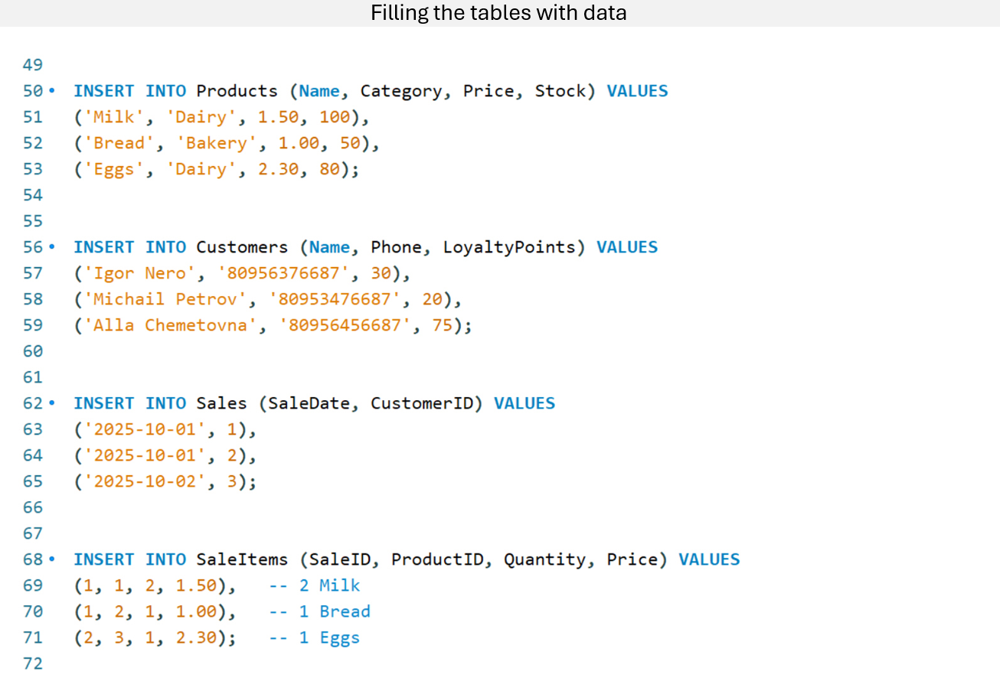

Through this activity, I practised database planning, relational design, and SQL fundamentals, applying them to a real-world business scenario.

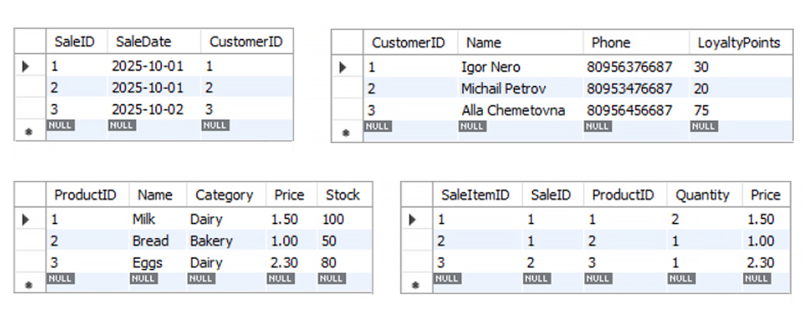

**Final SQL Task**  
I completed a series of real-world scenarios using SQL queries to explore and analyse demographic and economic data from a global cities database.

The exercises included:

- Counting and filtering cities by population, region, and name patterns  
- Identifying the most and least populated cities and countries  
- Calculating averages and population densities  
- Selecting and sorting data with specific limits  
- Using aggregate functions (COUNT, AVG, MAX, MIN) and conditional filters (WHERE, BETWEEN, LIKE, ORDER BY, LIMIT)  

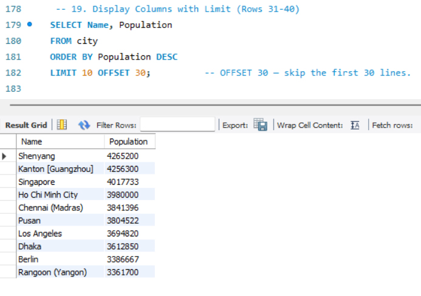

By the end of the week, I gained confidence in creating and managing databases, writing SQL queries, and analysing data from multiple tables.

**Skill List**

- Database design and structure  
- Creating tables and defining primary and foreign keys  
- Writing SQL queries (SELECT, WHERE, ORDER BY, LIMIT)  
- Using JOINs to combine data from multiple tables  
- Filtering, sorting, and aggregating data  
- Inserting and updating records in databases  
- Understanding relationships (one-to-one, one-to-many, many-to-many)  
- Performing aggregate queries and grouping results  
- Analysing real-world datasets to extract insights  

---

### Week 4 — Microsoft Azure

During the fourth week of the Just IT Data Technician Bootcamp, I focused on learning about Microsoft Azure and how cloud services support modern data management. I studied different types of clouds (public, private, hybrid, community) and cloud service models such as IaaS, PaaS, and SaaS, learning how businesses use them in real-world situations. I also explored UK data protection laws, including the Computer Misuse Act, GDPR, and the Data Protection Act 2018, understanding how they support the safe use of digital data.

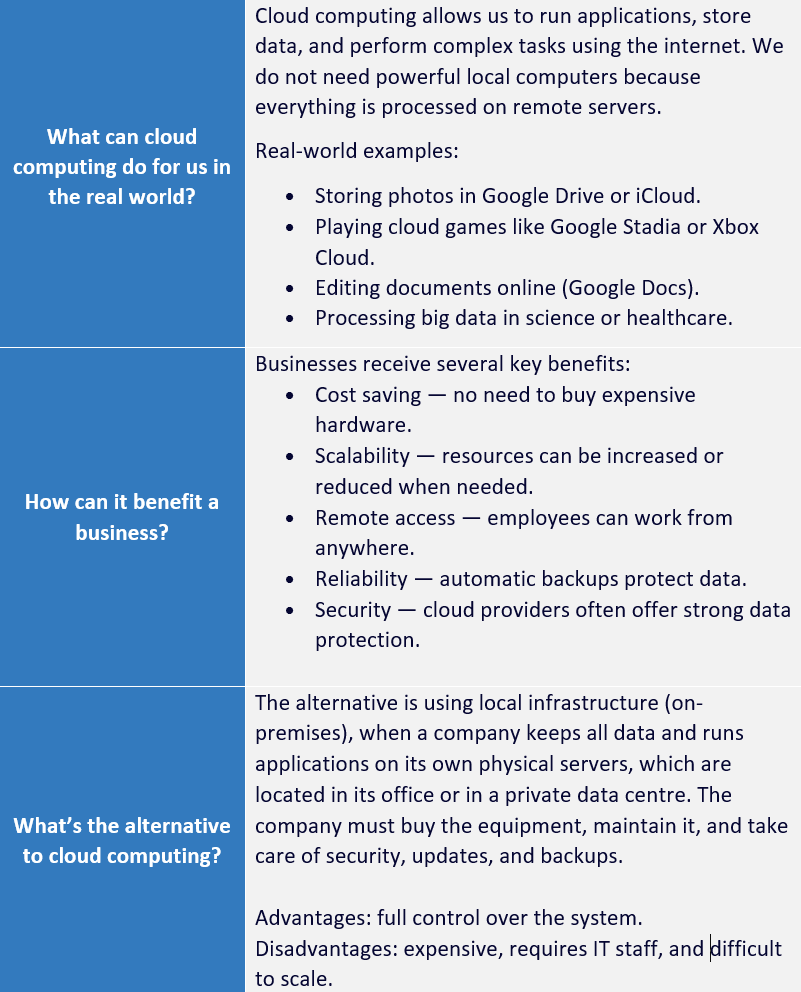

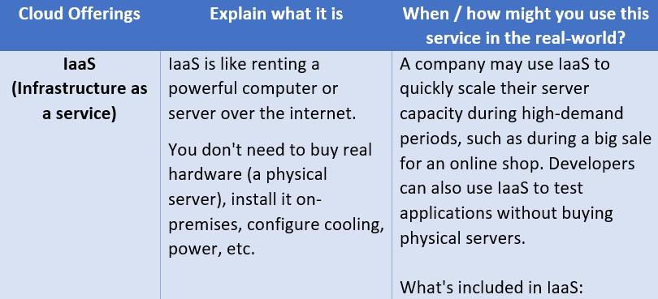
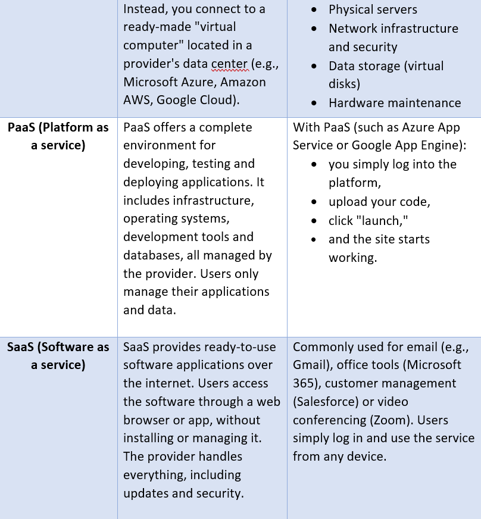

During the labs, I completed Azure learning paths on relational, non-relational, and analytical data in Azure.

As part of a business scenario, I created a report for a small company called “Paws & Whiskers”, explaining how to migrate from Excel to Azure using services such as Azure SQL Database, Azure Data Factory, Azure Blob Storage, and Power BI.

**Skill List**

- Understanding cloud computing and its benefits  
- Explaining IaaS, PaaS, and SaaS models  
- Identifying types of cloud: public, private, hybrid, community  
- Knowledge of data protection laws (GDPR, DPA 2018, Computer Misuse Act)  
- Using Azure SQL Database, Azure Blob Storage, and Data Factory  
- Understanding relational, non-relational, and analytical data in Azure  
- Data modelling and migration from Excel to Azure  
- Creating dashboards with Power BI for business insights  

---

### Week 5 — Python

During the fifth week of the Just IT Data Technician Bootcamp, I learned how to use Python for data analysis and automation. I started with simple coding tasks such as FizzBuzz, where I practised loops, conditions, and logic.

**Wrote the code:**

- to import CSV files into DataFrames  
- to display the first 5 rows of a DataFrame  
- to get information and summary statistics about a DataFrame  
- to select specific columns and rows  
- to add a new column based on a condition  
- to rename and drop columns  
- to group a DataFrame by a column and calculate the mean mark for each group  
- to count the number of students in each class  
- to calculate the average mark for each gender  
- to create a pivot table  
- to sort a DataFrame by the ‘mark’ column  
- to save a DataFrame to a new CSV file  

**Pie Chart Development Process**

I created a series of pie charts in Python using Matplotlib to visualise student performance by grades and gender. The project went through four main versions, each adding new features and improving the design and readability.

- **Version 1 – Basic Chart:** Created a simple pie chart showing gender distribution and percentages.
- **Version 2 – First Grade Chart:** Added grade distribution (A, B, C, D), new colours, rounded percentages, and rotation from top clockwise.
- **Version 3 – Adding Style and Legend:** Set manual colours, changed font, added legend, and improved background.
- **Version 4 – Final Version with Data Table:** Added a table with all students who received grade A (Excellent), improved design and sorting, and fixed display issues.

By the end of the week, I was able to clean, transform, and visualise data in Python confidently.

**Skill List**

- Writing basic Python code (loops, conditions, and functions)  
- Working with data using Pandas  
- Importing and exporting CSV files  
- Filtering, sorting, and grouping data  
- Creating new calculated columns and derived fields  
- Building pivot tables and aggregating results  
- Visualising data with Matplotlib  
- Analysing data patterns, trends, and results  
- Using Python for data cleaning, transformation, and reporting

